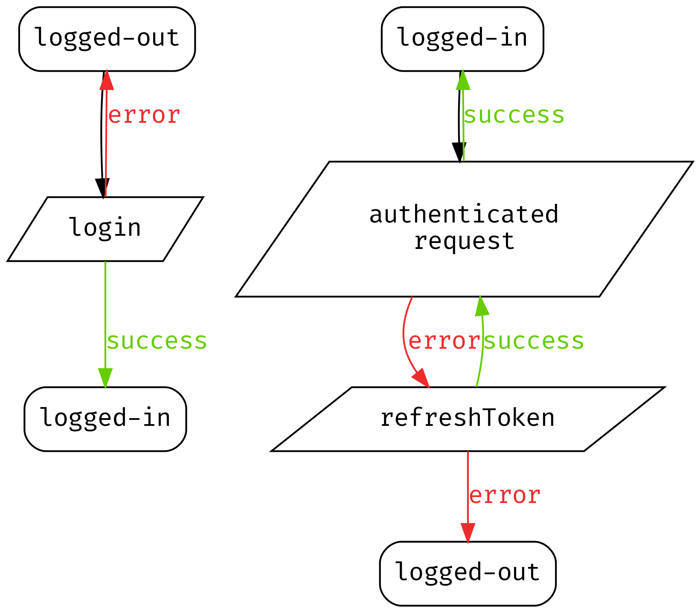

# Krypton Client Specification

> The key words "MUST", "MUST NOT", "REQUIRED", "SHALL", "SHALL NOT", "SHOULD", "SHOULD NOT", "RECOMMENDED",  "MAY", and "OPTIONAL" in this document are to be interpreted as described in [RFC 2119](https://tools.ietf.org/html/rfc2119).

There is two types of clients:
- *User clients*: they provide an API to manage a single user session in a client application. In the future, they will also provide UI views to ease the integration into applications.
- *Middlewares*: they integrate with server frameworks (Django, Express, etc.) to verify token signatures, and inject the decoded token in the request.

As far as possible, clients must follow the idioms and conventions of the target platform/language.

## User Clients

### State

User clients are typically stateful since they need to store the user token and the refresh token.
Clients must be thread-safe, such that a client instantiated in one thread, can be safely re-used in another thread.

### API

User clients must implement the following public API.

#### Unauthenticated requests

- `register(username: str, email: str, password: str, **fields) -> Optional[Error]`
- `login(login: str, password: str) -> (Optional[Dict], Optional[Error])`
- `resetPassword(email: str) -> Optional[Error]`
- `userOne(**fields) -> (Optional[Dict], Optional[Error])`
- `userById(id: str) -> (Optional[Dict], Optional[Error])`
- `userByIds(ids: List[str]) -> (List[Dict], Optional[Error])`

In the `login` function, the user is decoded from the token returned by the server.  
In the `user...` functions, all public fields are requested.

#### Authenticated requests

- `update(**fields) -> Optional[Error]`
- `delete(password: str) -> Optional[Error]`

### UI Views

TBD

### Error Handling

#### Exceptions

If permitted by the language, errors must be raised as typed exceptions, such that the client can be used as follow:

```python
client = KryptonClient()
try:
  client.register(...)
except UsernameAlreadyExistsError:
  print('Username already exists...')
```

Internationalization is to be performed by the client.

#### Token Invalidation




## Middlewares

TBD.
