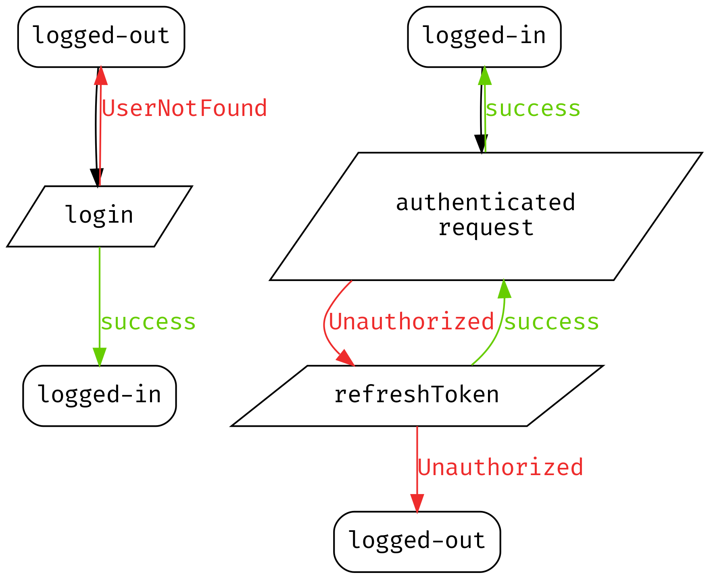

# krypton client specification

> The key words "MUST", "MUST NOT", "REQUIRED", "SHALL", "SHALL NOT", "SHOULD", "SHOULD NOT", "RECOMMENDED",  "MAY", and "OPTIONAL" in this document are to be interpreted as described in [RFC 2119](https://tools.ietf.org/html/rfc2119).

## Types of clients

There is two types of client:
- *User Client*
- *Middleware*

Two types of clients:
- Client (API + GUI), that 
- Middleware

## Error Handling

### Exceptions

Errors must be typed and returned to the client
using exceptions if possible.

Try to use idiomatic concepts for the target platform/language.
